# 📚 BookStore – MERN Stack

An online bookstore built with the **MERN stack**, allowing users to explore books, manage their carts, and place orders, while admins can manage inventory and track orders efficiently.

---

## 🚀 Features

### 🔹 User Features  
- 📖 **Browse Books** – View and explore **50+ books** across categories.  
- ❤️ **Favorites** – Add books to a favorites list for easy access.  
- 🛒 **Cart Management** – Add, remove, or modify items in the cart.  
- 💰 **Order & Checkout** – Place orders with **Cash on Delivery (COD)**.  
- 📜 **Order History** – View personal order history (**100+ orders managed**).  

### 🔹 Admin Features  
- 📦 **Manage Books** – Add, update, or remove books.  
- 📊 **Order Management** – Track and manage **all orders**.  

### 🔹 Performance & Optimization  
- 🚀 **Server-Side Rendering (SSR)** – Reduces initial load time by **40%**.  
- ⚡ **Optimized API Responses** – Improves performance by **35%**.  
- 🔐 **Secure Authentication** – Implemented **JWT-based authentication**.  

---

## 🛠️ Technologies Used  
- **Frontend:** React.js, Redux, Tailwind CSS  
- **Backend:** Node.js, Express.js  
- **Database:** MongoDB  
- **Authentication:** JSON Web Token (JWT)  

---

## 📸 Screenshots  

### 🏠 Home Page  
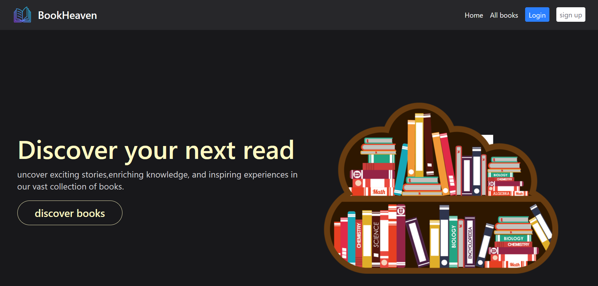  
  

### 🔑 Signup Page / Login Page  
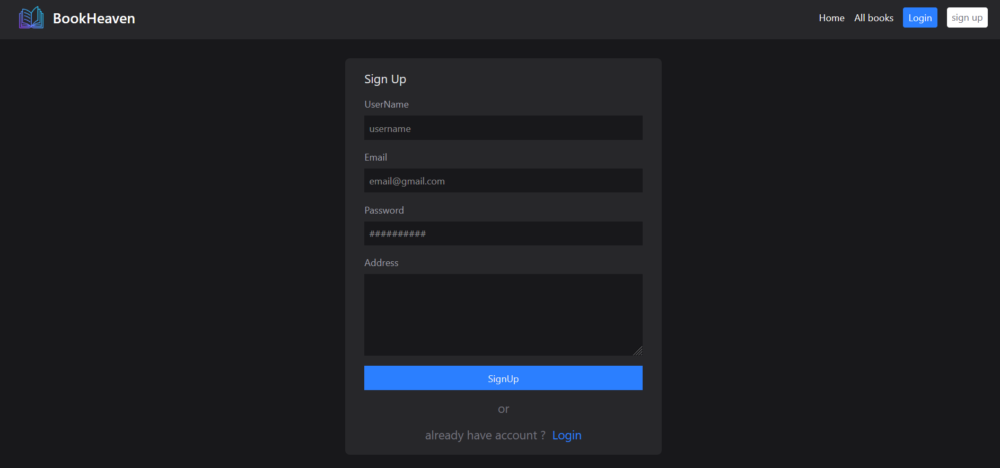  
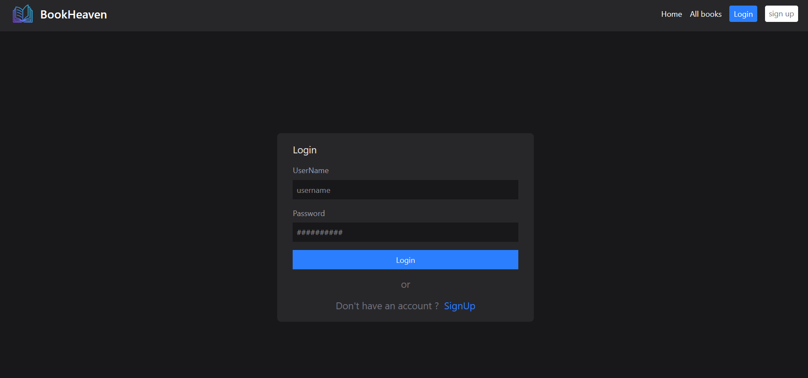  

### 📚 All Books  
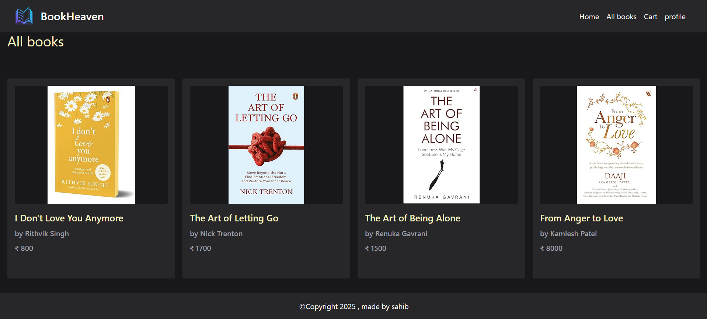  

### 📖 Book Details  
  

### ❤️ Favorites Page  
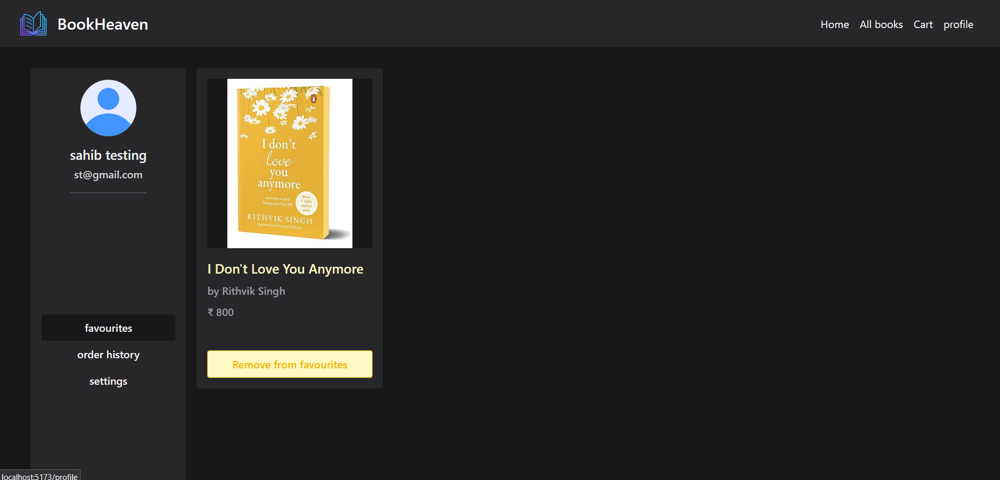  

### 🛒 Cart Page  
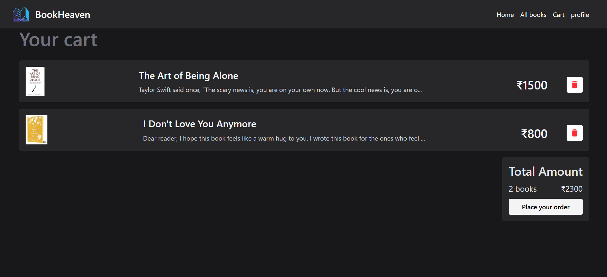  

### 🛍️ User Order Summary  
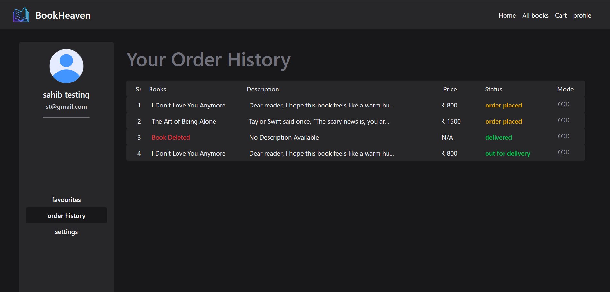  

### 🛍️ Admin Panel  
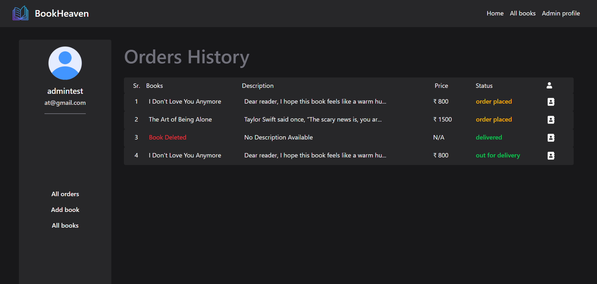  

### ➕ Add Book  
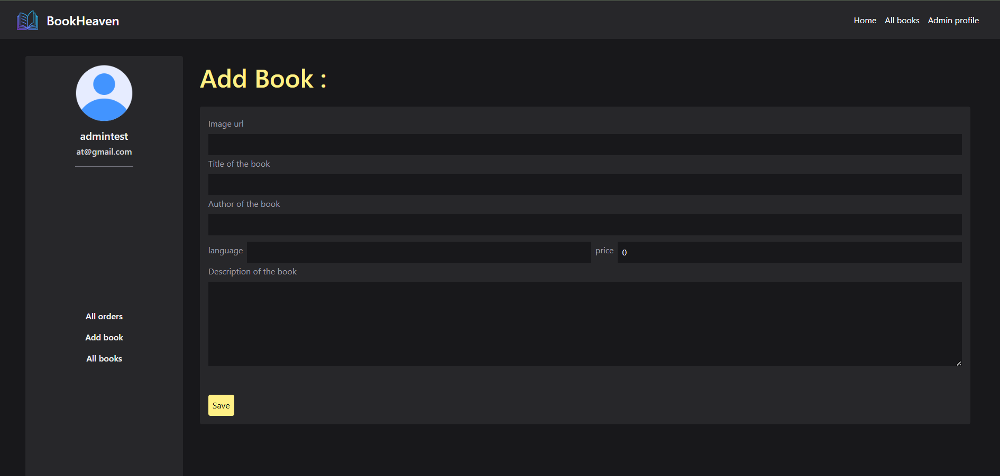  

### 🛍️ Admin View Order Details  
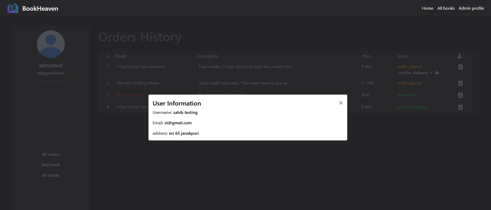  

### ✏️ Edit Book or User / Add to Favorites / Delete  
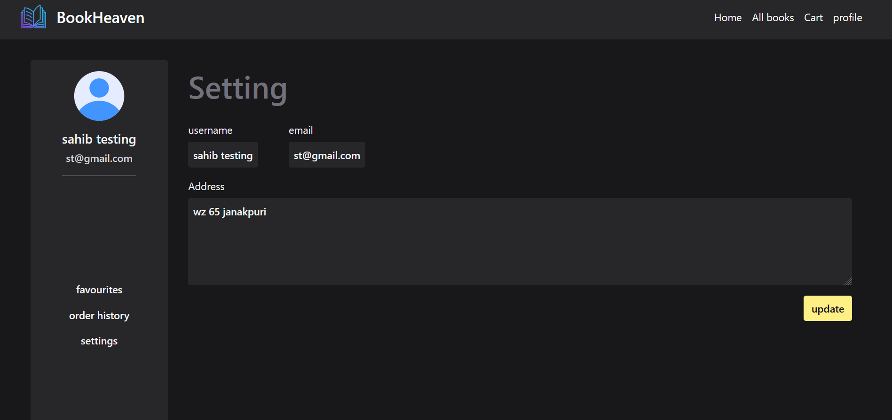  
  
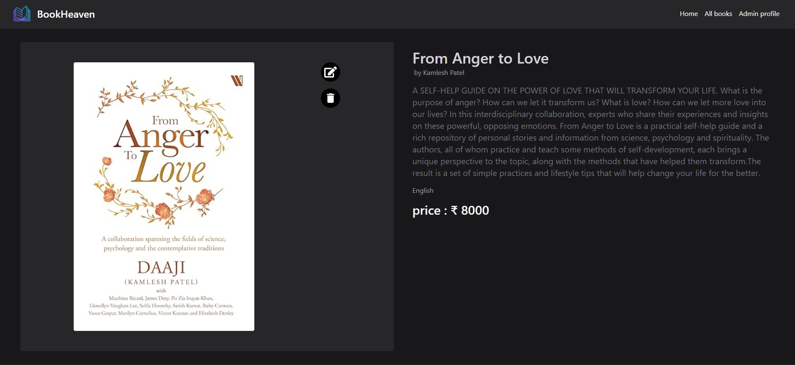  

---

## 🎯 Future Enhancements  
✅ **Online Payment Integration** (Stripe, Razorpay)  
✅ **Book Reviews & Ratings**  
✅ **Advanced Search & Filters**  

---

## 📧 Contact
For queries, reach out:
✉️ mansahibsinghgalshi@gmail.com
---
## 📦 Installation & Setup  

### 1️⃣ Clone the Repository & Install Dependencies  
```bash
git clone https://github.com/your-username/BookStore.git
cd BookStore

# Install backend dependencies
cd backend
npm install


